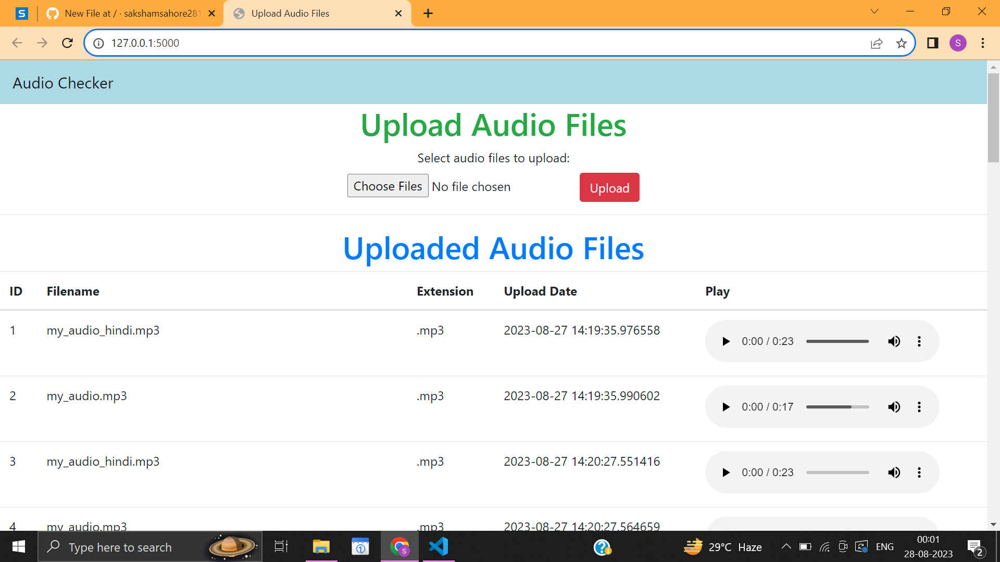

# Audio House

## Description
- This project gives a choice for the end-user to upload single or multiple audio files. The extension of the files is not fixed. 

- The files uploaded in the SQLite database are visible to the user in tabular form. The database consists of fields : serial number, file name, file extension, date and time of upload and an option to play the audio file.

- There is a warning generated if the length of the audio file exceeds 10 minutes.
- Kept the interface simple and clear.

## Tools and libraries used
- Flask 
- FlaskSQLAlchemy
- SQLite
- Mutagen
- PyDub
- Bootstrap
- Jinja 2

# Step by step Guide
- Clone the Repository:
Run this command to copy your GitHub repository to your computer:
~~~
git clone https://github.com/sakshamsahore2811/Audio-Checker
~~~
- Install Dependencies:

Open the terminal.
- Navigate to your project's directory:
cd your_project_directory (where you have cloned the repo)
- Create a virtual environment (a separate space for your project's libraries):
~~~
python -m venv venv
~~~
- Activate the virtual environment:
### On Windows:
~~~
venv\Scripts\activate
~~~
### On macOS and Linux:
~~~
source venv/bin/activate
~~~
- Install the required packages:
~~~
pip install -r requirements.txt
~~~
- Set Up the Database:

Run these commands to initialize and update your database:
~~~
flask db init
flask db migrate -m "Initial migration"
flask db upgrade
~~~

- Run the Application:

In the terminal, while the virtual environment is active, run your app:
~~~
flask run
~~~
Open a web browser and go to http://127.0.0.1:5000 to see your app.
- Testing:

Upload audio files to see if your app works as expected.
Make sure the files are displayed and playable.

## Screenshot

